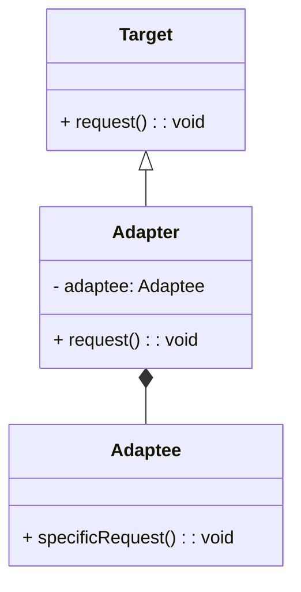

# Wzorzec Pośrednik (_Adapter Pattern_)

Dostosowuje do siebie obiekty o **niekompatybilnych** interfejsach.

- Umożliwia obiektom współpracę poprzez dostosowanie interfejsu jednego obiektu do oczekiwanego interfejsu drugiego. Dzięki temu obiekty o niezgodnych interfejsach mogą ze sobą współdziałać.
- Oozwala na integrację istniejących klas lub komponentów, które nie współpracują ze sobą ze względu na niezgodność interfejsów. Pozwala to na wykorzystanie istniejących komponentów bez konieczności modyfikowania ich kodu.

## Diagram

## Zastosowania

1. **Integracja bibliotek:** Gdy korzystamy z zewnętrznej biblioteki, której interfejs nie odpowiada naszym potrzebom, możemy stworzyć adapter, który dostosuje ten interfejs do naszych wymagań, umożliwiając integrację z naszym kodem.

2. **Przekształcanie formatów danych:** Gdy mamy do czynienia z różnymi formatami danych (np. XML, JSON), adapter może być użyty do przekształcenia jednego formatu danych na inny, umożliwiając komunikację między różnymi systemami.

3. **Interfejs sieciowy:** W przypadku komunikacji z zewnętrznymi serwisami, adapter może przekształcać żądania i odpowiedzi HTTP na formy, które są zrozumiałe dla naszej aplikacji, a także na odwrót.

