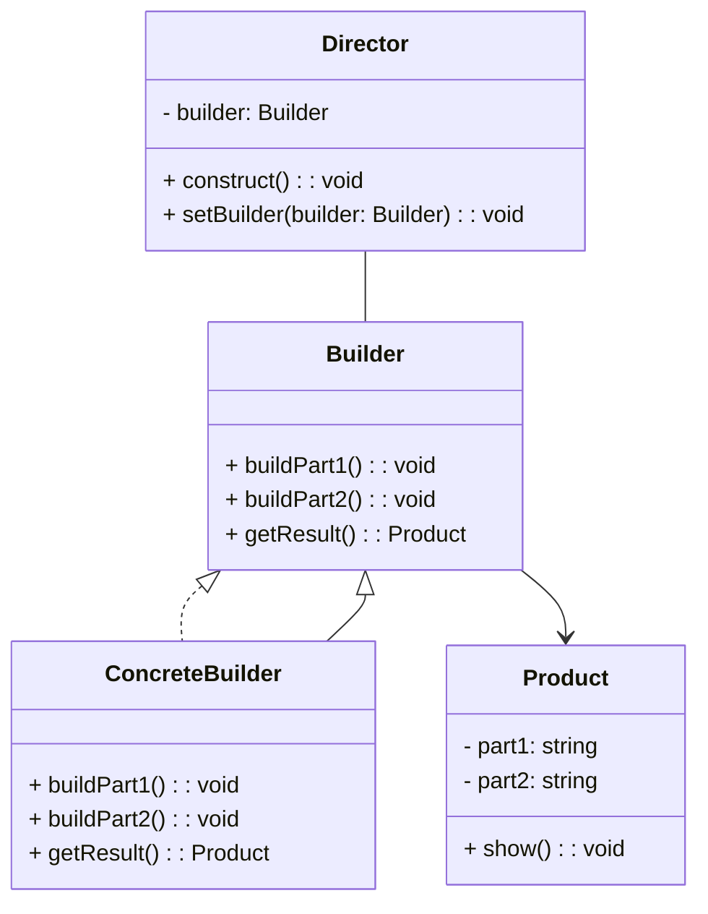

# Wzorzec Budowniczy (_Builder Pattern_)

Oddziela **konstrukcję** obiektu od jego **reprezentacji**.

- Umożliwia konstruowanie **złożonych** obiektów krok po kroku.
- Pozwala produkować różne typy oraz **reprezentacje** obiektów używając tego samego kodu konstrukcujnego.

## Diagram

## Zastosowania

Oczywiście! Oto kilka przykładowych zastosowań wzorca Builder:

1. **Tworzenie obiektów złożonych:** Wzorzec Builder jest użyteczny, gdy konstrukcja obiektu wymaga wielu kroków lub gdy obiekt ma złożoną strukturę. Na przykład, gdy tworzysz obiekt reprezentujący zamówienie online, który może zawierać wiele produktów, dane klienta, adres dostawy itp.

2. **Konfiguracja obiektów:** Wzorzec Builder jest przydatny w przypadku konfigurowania obiektów z wieloma opcjami, gdzie nie wszystkie opcje są wymagane, a niektóre mogą mieć domyślne wartości. Na przykład, gdy tworzysz obiekt reprezentujący konfigurację systemu komputerowego, który ma wiele opcji, takich jak rodzaj procesora, ilość pamięci RAM, dyski, itp.

3. **Generowanie dokumentów:** Wzorzec Builder może być stosowany do generowania dokumentów w różnych formatach, takich jak HTML, XML, JSON, itp. Na przykład, gdy tworzysz generator raportów, który może tworzyć raporty w różnych formatach w zależności od preferencji użytkownika.

4. **Tworzenie interfejsów użytkownika:** W przypadku tworzenia interfejsów użytkownika, gdzie każdy element interfejsu może mieć wiele opcji konfiguracyjnych, wzorzec Builder może ułatwić budowanie i konfigurowanie tych elementów.

5. **Tworzenie testowych obiektów:** W testach jednostkowych często potrzebujemy tworzyć obiekty z określonymi wartościami, ale nie zawsze chcemy ustawiać każdy parametr ręcznie. Wzorzec Builder może pomóc w tworzeniu testowych obiektów z odpowiednimi wartościami w bardziej czytelny sposób.