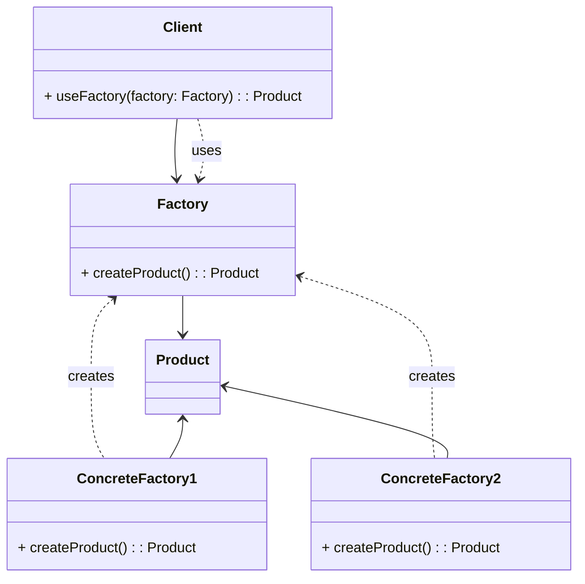

# Wzorzec Fabryki (_Factory Pattern_)

Oddziela **tworzenie** obiektu od jego **użycia i reprezentacji**.

- Umożliwia tworzenie różnych typów obiektów poprzez jednolite interfejsy.
- Pozwala na elastyczne zarządzanie procesem tworzenia obiektów bez konieczności bezpośredniego wywoływania konstruktorów.
- Umożliwia zmianę typów tworzonych obiektów bez konieczności zmiany kodu klienta.

## Diagram

## Zastosowania

Przykładowe zastosowania wzorca Fabryki:

1. **Tworzenie różnych typów połączeń sieciowych** w aplikacji internetowej, takich jak połączenia HTTP, FTP czy WebSocket, przy użyciu wspólnego interfejsu fabryki.

2. **Implementacja mechanizmu generowania raportów** w systemie, gdzie różne rodzaje raportów (np. PDF, Excel, HTML) są tworzone przez odpowiednie fabryki z wykorzystaniem wspólnego interfejsu.

3. **Budowanie interfejsów użytkownika** w złożonych aplikacjach, gdzie różne rodzaje elementów UI (np. przyciski, pola tekstowe, etykiety) są tworzone przez fabryki zgodnie z wymaganiami.

4. **Implementacja mechanizmu ładowania pluginów** w programach, gdzie różne typy pluginów są tworzone przez fabryki zgodnie z ich specyfikacją.

5. **Tworzenie różnych rodzajów połączeń bazodanowych** w aplikacjach, gdzie różne bazy danych (np. MySQL, PostgreSQL, SQLite) są obsługiwane przez odpowiednie fabryki.

6. **W grach komputerowych**, gdzie różne typy postaci, bronie czy poziomy są tworzone przez fabryki w zależności od scenariusza lub wyborów gracza.

7. **Implementacja mechanizmu obsługi formatów plików** w aplikacjach multimedialnych, gdzie różne typy plików (np. zdjęcia, filmy, dźwięki) są interpretowane przez odpowiednie fabryki.

