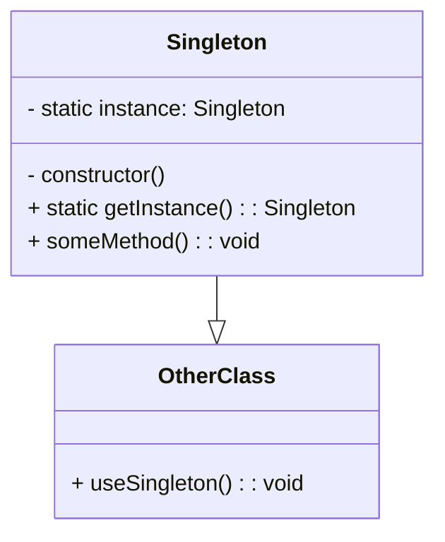

# Wzorzec Singleton (_Singleton Pattern_)

Zapewnia, że klasa posiada **pojedynczą** instancję.

- Ogranicza możliwość tworzenia wielu kopii tego samego obiektu w ramach aplikacji
- Umożliwia **globalny** dostęp do instancji klasy z dowolnego miejsca w programie

## Diagram

## Zastosowania

1. **Manager zasobów:** W grach komputerowych lub systemach graficznych, Singleton może być wykorzystywany do zarządzania zasobami, takimi jak tekstury, dźwięki czy modele 3D. Zapewnia to globalny dostęp do tych zasobów w całej aplikacji.

2. **Klasa konfiguracyjna:** Singleton może być używany do przechowywania ustawień konfiguracyjnych aplikacji, takich jak preferencje użytkownika, ścieżki do plików konfiguracyjnych czy parametry połączenia z bazą danych. Zapewnia to łatwy dostęp do konfiguracji z dowolnego miejsca w aplikacji.

3. **Obiekt sesji użytkownika:** W aplikacjach internetowych, Singleton może reprezentować sesję użytkownika, przechowując informacje o jego stanie, takie jak zalogowanie, uprawnienia czy zawartość koszyka zakupowego. Zapewnia to spójny dostęp do danych sesji w różnych częściach aplikacji.

4. **Klasa logowania:** Singleton może być używany do zapisywania logów aplikacji, umożliwiając jednolity dostęp do mechanizmu logowania z różnych modułów aplikacji.

5. **Menadżer połączeń bazodanowych:** W aplikacjach korzystających z baz danych, Singleton może zarządzać połączeniami z bazą danych, zapewniając jedną instancję połączenia, które może być współdzielone przez różne części aplikacji.

6. **Bufor pamięci podręcznej:** Singleton może być wykorzystany do implementacji bufora pamięci podręcznej, przechowującego często używane dane w celu poprawy wydajności aplikacji. Zapewnia to globalny dostęp do bufora pamięci podręcznej z różnych części aplikacji.