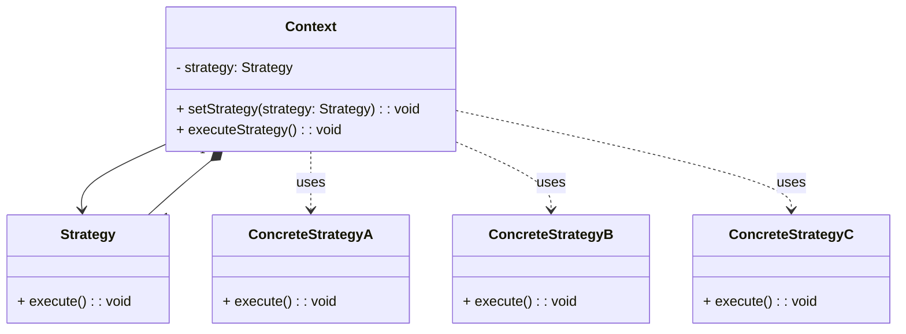

# Wzorzec Strategii (_Strategy Pattern_)

Oddziela **algorytm** od klienta, umożliwiając elastyczne stosowanie różnych strategii w czasie działania programu.

- Umożliwia dynamiczną zmianę zachowania obiektu poprzez wybór odpowiedniej strategii w trakcie działania aplikacji.
- Pozwala na enkapsulację algorytmów, co ułatwia zarządzanie nimi i zmniejsza zależności między komponentami systemu.

Dzięki wzorcowi Strategii, programista może definiować różne strategie w postaci oddzielnych klas i stosować je w zależności od potrzeb, bez konieczności zmiany samego obiektu, który z nimi współpracuje. Jest to szczególnie przydatne w przypadku, gdy zachowanie obiektu musi być zmieniane dynamicznie w trakcie działania programu.

## Diagram

## Zastosowania

Przykładowe zastosowania wzorca strategii:

1. **Algorytmy sortowania**: W zależności od wymagań lub danych wejściowych aplikacji, można używać różnych algorytmów sortowania (np. QuickSort, MergeSort, BubbleSort) poprzez zastosowanie strategii.

2. **Strategie płatności**: W aplikacjach e-commerce, różne strategie płatności mogą być stosowane w zależności od preferencji klienta lub rodzaju transakcji (np. płatność kartą, PayPal, przelew bankowy).

3. **Strategie wyszukiwania**: W systemach wyszukiwania, można stosować różne strategie wyszukiwania (np. przeszukiwanie liniowe, wyszukiwanie binarne, algorytmy heurystyczne) w zależności od rodzaju danych lub efektywności.

4. **Walidacja danych**: W systemach walidacji danych, można stosować różne strategie walidacji (np. walidacja pola tekstowego, walidacja adresu email, walidacja numeru telefonu) w zależności od rodzaju danych wejściowych.

5. **Strategie kalkulacji cen**: W aplikacjach finansowych lub handlowych, różne strategie kalkulacji cen mogą być stosowane w zależności od rodzaju produktu, promocji lub sezonu.

6. **Zarządzanie kompresją danych**: W aplikacjach do kompresji danych, różne strategie kompresji (np. zlib, gzip, LZMA) mogą być stosowane w zależności od rodzaju danych wejściowych i oczekiwanego stopnia kompresji.

7. **Strategie generowania raportów**: W systemach generowania raportów, można stosować różne strategie generowania raportów (np. PDF, Excel, HTML) w zależności od preferencji użytkownika lub celu raportu.

